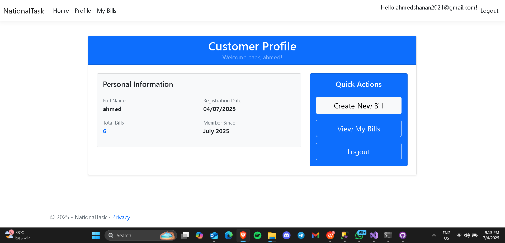

### Dashboard


# NationalTask - Bill Management System

A modern, user-friendly web application for managing bills and products with a clean, simple design built using ASP.NET Core MVC.

## 🚀 Features

### 1. **User Authentication & Registration**
- Secure user registration and login system
- Role-based access control (Customer & Admin roles)
- Admin access with hardcoded credentials for system management
- Automatic customer profile creation upon registration

### 2. **Customer Bill Management**
- Create and manage personal bills with multiple products
- View detailed bill information including customer data and product breakdown
- Track bill history with creation dates and total amounts
- Print bills for record keeping and sharing

### 3. **Product Catalog System**
- Pre-configured product database with pricing
- Dynamic product selection during bill creation
- Support for multiple products per bill with quantity management
- Automatic total price calculation based on quantity and unit price

### 4. **Admin Dashboard**
- Administrative view of all customer bills across the system
- Bill deletion capabilities for system maintenance
- Customer information display with registration details
- Comprehensive bill management tools

### 5. **Modern User Interface**
- Clean, responsive design using Bootstrap 5
- Card-based layouts for better content organization
- Intuitive navigation with clear visual hierarchy
- Mobile-friendly interface for all devices

## 🛠️ Technology Stack

- **Backend**: ASP.NET Core 8.0 MVC
- **Database**: SQL Server with Entity Framework Core
- **Authentication**: ASP.NET Core Identity
- **Frontend**: Bootstrap 5, HTML5, CSS3, JavaScript
- **Reporting**: DevExpress Reporting
- **Architecture**: Repository Pattern with Dependency Injection

## 📋 Prerequisites

- .NET 8.0 SDK
- SQL Server (LocalDB or full instance)
- Visual Studio 2022 or VS Code

## 🔧 Installation

1. **Clone the repository**
   ```bash
   git clone [repository-url]
   cd NationalTask
   ```

2. **Configure the database**
   - Update the connection string in `appsettings.json`
   - Run Entity Framework migrations:
   ```bash
   dotnet ef database update
   ```

3. **Run the application**
   ```bash
   dotnet run
   ```

4. **Access the application**
   - Navigate to `https://localhost:5001` or `http://localhost:5000`
   - Register a new account or use admin credentials:
     - Email: `admin_1@gmail.com`
     - Password: `Admin123!`

## 🎯 Usage

### For Customers:
1. Register a new account
2. Navigate to "Create Bill" to add products
3. View your bills in "My Bills" section
4. Print bills as needed

### For Admins:
1. Login with admin credentials
2. Access "All Bills" to view system-wide bill data
3. Manage bills with delete functionality
4. Monitor customer activity

## 📁 Project Structure

```
NationalTask/
├── Controllers/          # MVC Controllers
├── Models/              # Entity Models
├── DTOs/                # Data Transfer Objects
├── Repository/          # Repository Pattern Implementation
├── Data/                # Database Context
├── Views/               # Razor Views
├── Reports/             # DevExpress Reports
└── wwwroot/             # Static Files
```

## 🔐 Security

- Password requirements: Minimum 6 characters with uppercase, lowercase, and digit
- Role-based authorization for admin functions
- Secure authentication using ASP.NET Core Identity
- Input validation and model binding

## 📄 License

This project is licensed under the MIT License - see the LICENSE file for details.

## 🤝 Contributing

1. Fork the repository
2. Create a feature branch
3. Commit your changes
4. Push to the branch
5. Create a Pull Request

---

**Built with ❤️ using ASP.NET Core**
